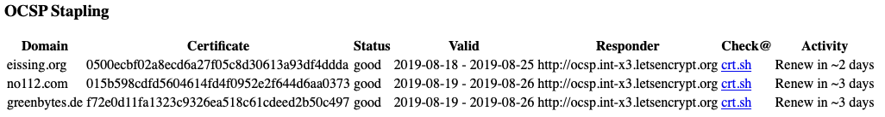
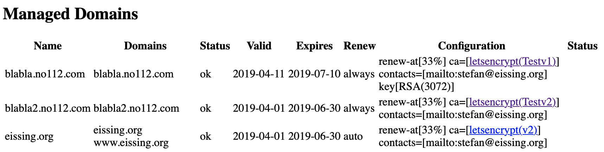

# mod_md - Let's Encrypt for Apache

This repository contains `mod_md`, a module for Apache httpd that helps you to manage your domains.

## What is it good for?

`mod_md` does two things:

1. Provide ***SSL certificates*** for your domains from Let's Encrypt (or another Certificate Authority that supports the ACME protocol, rfc8555)
2. Offer robust ***OCSP Stapling*** of SSL certificates which is important for fast page loads in modern browsers.

Both functions work well together, but you can use one without the other. If you do not want the ACME/Let's Encrypt parts, there is ["Just the Stapling, Mam!"](#just-the-stapling-mam)

## Thanks

The following people directly contributed to `mod_md` by code and documentation changes:
Alvaro Octal, Bernard Spil, Daniel Caminada, Jacob Hoffman-Andrews, Joe Orton,
Josh Soref, Lubos Uhliarik, Michael Kaufmann, Michael Köller,
Michal Karm Babacek, Timothe Litt. 

Many thanks!

## Versions and Releases

This README always describes the current version of the module. This might not actually be what you use. You can look
into your Apache server log where `mod_md` logs its version at startup. There are three major release lines nowadays which are all upwards compatible:

 * `v2.3.x` releases are ***beta***, the new feature is support for multiple certificates and ECDSA keys. 
 * `v2.2.x` releases are ***stable***. They can be used in production and new versions will be backward 
   compatible with existing configurations.  
   The large feature added in v2.2.0 is OCSP stapling. This release line shipped in Apache httpd 2.4.46.
   Apache releases will always get the latest, stable version from here. 
 * `v2.1.x` releases have been ***beta***, leading up to v2.2.0 
 * `v2.0.x` releases should be upgraded to `v2.2.x` whenever convenient. No new releases in this line will happen. 


## Index

  - [HowTos](#howtos):
    * [Add a new `https:` Host](#how-to-add-a-new-host)
    * [Add `https:` to a `http:` Host](#how-to-add-https-to-a-host)
    * [Migrate an existing `https:` Host](#how-to-migrate-a-https-host)
    * [Have many Names for a Host](#how-to-have-many-names-for-a-host)
    * [Live with `http:`](#how-to-live-with-http)
    * [Live without `http:`](#how-to-live-without-http)
    * [Analyze and fix problems](#how-to-fix-problems)
  - Advanced:
    * [Have one cert for several Hosts](#how-to-have-one-cert-for-several-hosts)
    * [Have an Extra Name in a Certificate](#how-to-have-an-extra-name-in-a-cert)
    * [Have Individual Settings](#how-to-have-individual-settings)
    * [Backup, Restore or Start Over](#how-to-backup-restore-or-start-over)
    * [Get a Wildcard Cert](#how-to-get-a-wildcard-cert)
    * [Use Other Certificates](#how-to-use-other-certificates)
    * [Have two certs for one Host](#how-to-have-two-certs-for-one-host)
  - Stapling
    * [Staple all my certificates](#how-to-staple-all-my-certificates)
    * [Staple some of my certificates](#how-to-staple-some-of-my-certificates)
    * [Know which Stapling You Want](#how-to-know-which-stapling-you-want)

  - [Installation](#installation)
  - [Upgrading](#upgrading)
  - [Lets Encrypt Migration](#lets-encrypt-migration)
  - [Monitoring](#monitoring)
  - [Using Lets Encrypt](#using-lets-encrypt)
  - [Basic Usage](#basic-usage)
  - [Changing Domains](#changing-domains)
  - [Redirecting to https](#redirecting-to-https)
  - [Ports Ports Ports](#ports-ports-ports)
  - [TLS ALPN Challenges](#tls-alpn-challenges)
  - [Wildcard Certificates](#wildcard-certificates)
  - [Dipping the Toe](#dipping-the-toe)
  - [File Storage](#file-storage)
  - [Configuration Directives](#directives)
  - [Test Suite](#test-suite)

 
 
# HowTos

This is a list of recipes on how you can use `mod_md` in your Apache configuration. This assumes that you are somewhat familiar with Apache's configuration directives `Listen`, `VirtualHost`, `SSLEngine` and friends. It also assumes that your Apache is running, has the basic modules loaded. You can see a document in your browser (maybe only on `http:` for now).

### Prerequisites

Your Apache is working and listens on port 80. It runs on a machine you can connect to. You want it to serve `https:`. And it should be _real_ `https:` with a certificate from Let's Encrypt and it should show a green lock (or whatever is the fashion nowadays) in browsers. 

Well, there are some prerequisites for that:

 * Do you have a domain name that your server should respond to? Let's call this `mydomain.com` for simplicity from now on.
 * Can you open `http://mydomain.com/` in a browser and get something back from your server?
 * Can you also do that from the internet? (When in doubt, switch off WLAN on your phone and open the browser from there)

This sounds good. You have a running setup for `http:`. In case you're not aware, `http:` runs on port 80. Somewhere in your Apache configuration there is a line like

```
Listen 80
```
`https:` listens on port 443. So, either this is already the case, or you need to add another `Listen` line for this. If you cannot immediately find it: some installations have it in another file that gets included. If it is not there, add it.

To use `mod_md` you need it loaded into your server. This varies a bit, depending on what installation you use. In debian/ubuntu, for example, there is a command to activate it:

```
> a2enmod md
Enabling module md.
To activate the new configuration, you need to run:
  service apache2 restart
```
There is no harm in doing this again:

```
> a2enmod md
Module md already enabled
```
Also make sure that `mod_ssl` and `mod_watchdog` are enabled. watchdog is often directly part of the server and not an external module. Then there is no need to enable it.

One more thing. There is usually an email address in your Apache configuration, configured with the `ServerAdmin` directive. Sometimes, it has a meaningless default. It has been mainly used in error responses as "Contact admin@something.com..." so far and people do not really lose sleep about it being an invalid address. Not so any more!

`mod_md` will use that email address when registering your domains at Let's Encrypt. And they will try to contact you with important news, should the need arise. So, make sure this is a real address that you monitor! 

If you want to be registered and contacted different email address, specify it with the MDContactEmail directive, which is preferred.

As the last thing, add the following line somewhere in your configuration:

```
MDCertificateAgreement accepted
```
With this you state that you accept the [Terms of Service](https://letsencrypt.org/documents/LE-SA-v1.2-November-15-2017.pdf) by Let's Encrypt.


## How to Add a New Host

Scenario: you have checked the [prerequisites](#prerequisites) and would like to add a new host that should be reachable via `https:`. 

As in all How To chapters, we use `mydomain.com` as the domain name. Exchange this with the name you actually have. In the Apache config (or one file included from it), you add now:

```
MDomain mydomain.com

<VirtualHost *:443>
  ServerName mydomain.com
  SSLEngine on
  DocumentRoot ...path-you-serve-here...
  ...
</VirtualHost>
```
and then you restart your server.

What did we do here? We made a host that answers on port 443 and we told `mod_ssl` that it should be active here. But we did not specify any certificates! If you look at examples for ssl in Apache on the web, there are always `SSLCertificateFile` and `SSLCertificateKEyFile` used. This is no longer necessary.

And while we left out parts of the SSL configurations that used to be necessary, we added one line of `mod_md` configuration: `MDomain <name>`. This is how you declare that a domain should be manged by `mod_md`. 

The module will use this name to find all hosts that belong to it and take care of those. When `mod_ssl` does not find any certificates, because you did not configure any, it will ask `mod_md`: "Hey, do you know anything about `mydomain.com`?" And it will answer: "Sure, use these files here for the certificates!"

During start up, the module will see that there are no certificates yet for `mydomain.com`. It could contact Let's Encrypt right away and request one - but who knows how long that might take. In the meantime, your server will not become active and request will just time out. No good. Instead it creates a temporary certificate itself for `mydomain.com` and pass that on to `mod_ssl`. Everything starts up and your server is responsive.

Now, when you open `https://mydomain.com/` in your browser now, it will complain because this temporary certificate cannot be trusted. If you tell it to ignore these security considerations (well, you should not), your server will answer every request to mydomain.com with a "503 Service Unavailable" message.

In the meantime, right after the Apache has started, `mod_md` will contact Let's Encrypt and request a certificate for your. This usually takes less than a minute. There are several ways to check the progress of this ([see Monitoring](#monitoring) for more), but for this first time you should maybe look into the server's error log.

If you find an entry there like:

```
[Date] [md:notice] [pid nnn] AH10059: The Managed Domain mydomain.com has been setup 
and changes will be activated on next (graceful) server restart.
```

If this does not happen, something is not right and [you should read here on how to analyze and fix problems](#how-to-fix-problems). But assuming this worked, you now simply do a reload of the server and `https://mydomain.com/` should work nicely and with a green lock in your browser. ("reload" is just a short name for a "graceful" restart, one that does not interrupt ongoing requests.)

Congratulations!

## How to Add https to a Host

Scenario: you have a Host responding to `http:` requests, you have checked the [prerequisites](#prerequisites) and would like to have that host reachable via `https:` as well.

As in all How To chapters, we use `mydomain.com` as the domain name. Exchange this with the name you actually have. In the Apache config you will have something like this already:

```
<VirtualHost *:80>
  ServerName mydomain.com
  DocumentRoot ...path-you-serve-here...
  ...
</VirtualHost>
```

This is the host that you already have. Now, make a copy of that, change the port and switch SSL on:

```
MDomain mydomain.com

<VirtualHost *:80>
  ServerName mydomain.com
  DocumentRoot ...path-you-serve-here...
  ...
</VirtualHost>

<VirtualHost *:443>
  ServerName mydomain.com
  SSLEngine on
  DocumentRoot ...path-you-serve-here...
  ...
</VirtualHost>
```

Then you reload your Apache server. It will start up right away, as before, and your `http://mydomain.com/` links will work as they used to. If you open `https://mydomain.com/` in your browser, you will get a security warning. If you tell it to ignore that you will get a `503 Service Unavailable` response.

What is happening? At start up, mod_md generated a self-signed certificate for the new https host to use and switch that host to 503 responses. This made sure that your server started without delay and that your other hosts could start working.

When Apache is done with start up, `mod_md` spins up a background thread that contacts LetsEncrypt and negotiates a certificate for `mydomain.com`. This usually takes a few seconds, but there are several things that may delay this: bad internet connectivity, maintenance at LetsEncrypt, problems with DNS resolutions somewhere, etc.

There are several ways to check the progress of this ([see Monitoring](#monitoring) for more), but for this first time you should maybe look into the server's error log.

If you find an entry there like:

```
[Date] [md:notice] [pid nnn] AH10059: The Managed Domain mydomain.com has been setup 
and changes will be activated on next (graceful) server restart.
```

If this does not happen, something is not right and [you should read here on how to analyze and fix problems](#how-to-fix-problems). But assuming this worked, you now simply do a reload of the server and `https://mydomain.com/` should work nicely and with a green lock in your browser. ("reload" is just a short name for a "graceful" restart, one that does not interrupt ongoing requests.)


## How to Migrate a https: Host

Scenario: you have a Host responding to `https:` requests already that has valid certificates. You want this host to be managed by `mod_md` with certificates from LetsEncrypt. You have checked the [prerequisites](#prerequisites).

As in all How To chapters, we use `mydomain.com` as the domain name. Exchange this with the name you actually have. In the Apache config you will have something like this already:

```
<VirtualHost *:443>
  ServerName mydomain.com
  SSLEngine on
  SSLCertificateFile /etc/mycertificates/mydomain-certs.pem
  SSLCertificateKeyFile /etc/mycertificates/mydomain-key.pem
  DocumentRoot ...path-you-serve-here...
  ...
</VirtualHost>
```

You add one line to this, maybe just before the `VirtualHost`:

```
MDomain mydomain.com

<VirtualHost *:443>
  ServerName mydomain.com
  SSLEngine on
  SSLCertificateFile /etc/mycertificates/mydomain-certs.pem
  SSLCertificateKeyFile /etc/mycertificates/mydomain-key.pem
  DocumentRoot ...path-you-serve-here...
  ...
</VirtualHost>
```
and reload you Apache server. Your server will start up as before and `https://mydomain.com` will also work as before. If you look at the certificate in your browser, it will be the same as before - namely the one from `/etc/mycertificates/mydomain-certs.pem`.

In your error log, you will however find a new entry:

```
[Date] [ssl:warn] [pid nnn] Init: (mydomain.com) You configured certificate/key files on this host, but 
it is covered by a Managed Domain. You need to remove these directives for the Managed Domain to take over.
```

In the meantime, `mod_md` is negotiating with LetsEncrypt for a new certificate for `mydomain.com`. There are several ways to check the progress of this ([see Monitoring](#monitoring) for more), but for this first time you should maybe look into the server's error log. If you find an entry there like:

```
[Date] [md:notice] [pid nnn] AH10059: The Managed Domain mydomain.com has been setup 
and changes will be activated on next (graceful) server restart.
```

(If this does not happen, something is not right and [you should read here on how to analyze and fix problems](#how-to-fix-problems).)

Now remove `SSLCertificateFile` and `SSLCertificateKeyFile` from your host. It should look now like this:

```
MDomain mydomain.com

<VirtualHost *:443>
  ServerName mydomain.com
  SSLEngine on
  DocumentRoot ...path-you-serve-here...
  ...
</VirtualHost>
```

Reload you Apache. Open `https://mydomain.com` in your browser. It should have a green lock and a certificate from Lets Encrypt now.

## How to Have many Names for a Host

In all examples so far, we used just `ServerName` in every `VirtualHost`. Our Managed Domains just had a single name.

It is very common to have more than one name and use `ServerAlias` to add them. A more typical host looks like this:

```
MDomain mydomain.com

<VirtualHost *:443>
  ServerName mydomain.com
  ServerAlias www.mydomain.com
  ...
</VirtualHost>
```

`mod_md` automatically looks at all domain names in hosts. You do not have to specify that. It will see `www.mydomain.com` and get a certificate that covers both names. It also works the other way around:

```
MDomain mydomain.com

<VirtualHost *:443>
  ServerName www.mydomain.com
  ServerAlias mydomain.com
  ...
</VirtualHost>
```

In general, it is good practise to use the shorter name in `MDomain`. It does not matter if that appears in `ServerName` or `ServerAlias`.

This check is done every time you start or reload Apache. If you add a name to your host, as in:

```
MDomain mydomain.com

<VirtualHost *:443>
  ServerName www.mydomain.com
  ServerAlias mydomain.com
  ServerAlias forum.mydomain.com
  ...
</VirtualHost>
```

`mod_md` will detect that the existing certificate does not cover `forum.mydomain.com` and contact LetsEncrypt to get a new one.

Should you _remove_ a name from a host, it will also see that. But since the existing certificate is still valid for all the names that are there, it will not renew the certificate. But when renewal is due anyway, it will use the new, shorter list of names.

One more advice: if you remove the name that you use in `MDomain` from a host, the host is no longer found. While there are ways to tricks around this, it is not recommended to go that direction. That is why using the shortest name is best in most cases.


## How to Live with http:

If you start a new domain nowadays, you probably only make it available via `https:`. But if you have been around for longer, your `http:` links maybe in use by many sites and you want to continue supporting those. However, since `http:` answers are being monitored and tampered with, you most likely want to redirect those to you `https:` equivalents.

There is, for example, `mod_rewrite`, which you can use for this. But `mod_md` also offers a directive:

```
MDRequireHttps temporary
```

which answers `http:` requests to a Managed Domain with a `302 Temporary Redirect` to the `https:` one (same path and query). 

The code 302 means that clients should continue asking for the original `http:` resource. So, should you change your mind, no harm is done. But if it all works out, your server should send clients a `301 Redirect` which instruct clients to always use the `https:` link and forget the other. As you might have guessed, you do this with:

```
MDRequireHttps permanent
```

This setting has another side effect: responses to `https:` requests are also marked as `permanent`. This uses the HTTP header [`Strict-Transport-Security`](https://en.wikipedia.org/wiki/HTTP_Strict_Transport_Security) to let clients know that they should never (e.g. for the next 6 months) talk http: to this domain. If they see a http: link, they will convert that to https: right away.


## How to Live without http:

In the previous howto, the support for `http:` links was addressed. Important for people who want to migrated existing sites to https:. But not having `http:` at all poses its own challenges. This happens, for example, when providers switch port 80 off for security reasons.

When your server negotiates a certificate with Let's Encrypt, this can be done in 3 different ways:

 1. using the `http:` protocol (port 80)
 2. using the `tls` protocol with `ALPN` (the `s` part of `https:`) (port 443)
 3. using the `DNS`

This is true for _all_ Let's Encrypt clients: `certbot`, `acme.sh`, `mod_md`, etc.

Assuming you do not have a DNS setup working, and your port 80 is blocked, this leaves only port 443. Let's Encrypt will open a connection to your server on this port and indicate that it wants to talk a very specific protocol named `acme-tls/1`. It then expects a very specific answer from the server.

For this to work with your Apache, you need to enable this protocol using the `Protocols` directive. See [TLS ALPN Challenges](#tls-alpn-challenges) for details.

## How to Fix Problems

The feedback from people using `mod_md` has been very positive, especially about the simplicity of the configuration. (However some people do not like this and seem to prefer more explicit configs. You can't please everyone.) Some people run into problems. Maybe there is a bug in `mod_md`. Maybe they have a networking setup that requires some special configurations, because the defaults just do not suffice.

And then there are, of course, things that break. E.g. your internet becoming partially unavailable. Google/AWS outages, etc. 

In the presence of always-possible, temporary disasters, auto-renewing your server certificates _in time_ is helpful. `mod_md` will renew certificates when a third of their lifetime is left. Since Let's Encrypt issues certificates valid for 90 days, such certificates are renewed 30 days in advance.

Besides the Apache error logs, where 'mod_md' also logs problems, there are two ways to monitor your Managed Domains: `server-status` and `md-status`. See [the chapter about Monitoring](#monitoring) for more details.

The best place on the net to check/discuss problems with Let's Encrypt is [community.letsencrypt.org](https://community.letsencrypt.org). Very helpful.

### Outgoing

Your Apache server reports that it has problems contacting Let's Encrypt. The problems can be

 * unable to connect: you should check if Let's Encrypt is reachable at all for you. The default `MDCertificateAuthority` is [https://acme-v02.api.letsencrypt.org/directory](https://acme-v02.api.letsencrypt.org/directory) and you should check if it answers. If it does, check if it answers also on the machine that your Apache runs on. Some server installations block outgoing connections. Maybe your server needs to use a HTTP proxy? See [MDHttpProxy](#mdhttpproxy) in that case.
 * unexpected status: `mod_md` got a response, but with an unexpected status code. For example:
   * `503`: this would indicate that Let's Encrypt does maintenance on their servers. This should go away after a short while.
   * other `5xx`: category _should not happen_. This points to an error in the LE software. Check the community.
   * `4xx` codes: LE thinks that `mod_md` has sent an invalid request. Check the current `mod_md` github for fixes. Check the community, if the issue is known. Or open a new issue at the github repository.
 * failure to parse the response: the only known case of this is when people configured their own `MDCertificateAuthority` and entered a wrong URL.
 * error in parsed response: in some cases, Lets Encrypt answers with an error document. This describes what went wrong from its perspective. For example, it could answer that it was unable to contact your server. Have a closer look at the description. Maybe something is wrong with your _incoming_ setup.

### Incoming

There are different areas where problems with _incoming_ connections to your Apache can appear:

  1. `mod_md` does not understand your network setup and complains. A common cause is that your server is behind a port mapper (internet modem, firewall) and does not listen to ports 80 and 443. Instead, it listens to - for example - 8000 and 8001. Use the directive [MDPortMap](#mdportmap) to tell the module where http/https request will arrive.
  1. `mod_md` _thinks_ it understands your network, but reality is far from it. For example, your Apache listens on port 80, but this port is not reachable from the internet. Maybe you use it just locally. `mod_md` might tell Let's Encrypt to use port 80, but that will then never succeed. In this case, configure `MDPortMap 80:-` to disable it for mod_md.
  2. Let's Encrypt is unable to reach your server, using one of the Managed domain names. You must understand that if your host has a variety of names (using `ServerAlias`), Let's Encrypt will need to verify _all of them_. If you use aliases that only resolve in your local network, you need to split your `VirtualHost` for that. In doubt, check that all domains of yours will reach your server - from the internet. Maybe a DNS record has the wrong address?
  
### Challenges

Sometimes, `mod_md` will not be able to get/renew a certificate because it cannot detect a suitable challenge method for LetsEncrypt. 

The most common cause is that you request a wildcard certificate, e.g. `*.mydomain.com` but do not have `MDChallengeDns01` configured. Let's Encrypt offers only DNS challenges for wildcard certificate. There is no choice. If your server is not able/configured to answer those, it will not work.

Another cause: if your server is not reachable on port 80 and you have not configured `acme-tls/1` (see [TLS ALPN Challenges](#tls-alpn-challenges) for details). Again, mod_md is not able to select a challenge for Let's Encrypt to perform.

Read the [chapter about ports](#ports-ports-ports) for more information about what is going on and what you can do.


# Advanced HowTos

## How to Have one Cert for Several Hosts

A feature we did not cover so far: you can specify more than one name in `MDomain`:

```
MDomain mydomain.com another.org

<VirtualHost *:443>
  ServerName mydomain.com
  ...
</VirtualHost>

<VirtualHost *:443>
  ServerName another.org
  ServerAlias www.another.org
  ...
</VirtualHost>
```

This will treat both hosts as belonging to the same Managed Domain. One certificate will be requested from Let's Encrypt and that will cover both names and all connected aliases. 

It depends on the domains and their use if this is a good approach or not. It might help browsers in using the same connection for both (browsers have sophisticated evaluation methods for this, it might not be as straightforward as your think). On the other hand, the more names in your certificate, the larger it is. Since it is sent to clients on every connection, there is overhead.

But, if it makes sense in your setup, this is how you do it with `mod_md`.

## How to Have an Extra Name in a Cert

Certificates are not only used in web servers like Apache. Mail and IMAP servers also make good use of them. Let's Encrypt can make those too, with a little bit of additional config.

If you want a certificate for `mail.mydomain.com` you need to make sure that `http:` and/or `https:` requests for that domain _from the internet_ arrive at your Apache. Maybe, you have a small setup where everything is on the same machine anyway, then there is nothing more to do. Should it be on another ip address, maybe port forwarding can help.

Let's say, you have solved this. You then configure:

```
MDomain mydomain.com mail.mydomain.com

<VirtualHost *:443>
  ServerName mydomain.com
  ...
</VirtualHost>
```

The mail domain gets added to the Managed Domain, but it does not need to appear in any host. `mod_md` will get a certificate that covers both names.

Should you want a _separate_ certificate for it, you can make a new MDomain, like:

```
MDomain mydomain.com
MDomain mail.mydomain.com

<VirtualHost *:443>
  ServerName mydomain.com
  ...
</VirtualHost>
```

Apache will accept this configuration, but - as you will find out - will not request a certificate for the mail domain. What is happening?

`mod_md` sees that `mail.mydomain.com` is not used in any host. Therefore, there is no need to have a certificate for it. This is what the module calls the `MDRenewMode` and it is `auto` by default. If you change this to `always`, it will request certificates also for managed domain that appear not to be in use.

## How to Have Individual Settings

If you have more than one Managed Domain, you soon run into the situation where you want different settings for them. You can use `<MDomain >` to achieve this:

```
MDomain mydomain.com

<MDomain another.org>
  MDRequireHttps permanent
</MDomain>

<VirtualHost *:443>
  ServerName mydomain.com
  ...
</VirtualHost>

<VirtualHost *:443>
  ServerName another.org
  ...
</VirtualHost>
```
This will switch on the permanent redirect to `https:` for `another.org` only. You can use this for most configuration directives of `mod_md`: authority url, drive mode, private keys, renew window and challenges.

## How to Backup, Restore or Start Over

`mod_md` stores all data as files underneath the `md` directory - or where ever you configured `MDStoreDir` to be. See [File Storage](#file-storage) for a description of this. If you backup this directory, you will have a copy of all your certificate and keys.

While this is nice, it is worth remembering that the master data is your Apache configuration. The rest is just created by it. This means, if you _only_ restore this `md` directory and _not_ the Apache configuration files, this will be pretty meaningless.

On the other hand, if you restore the configuration and _not_ the `md` directory, your Apache will request all necessary certificates anew and, after a short while, you will be back to where you started. With different, but valid certificates nevertheless.

Therefore, in case of severe troubles, it is an option to throw away the `md` directory and make a restart (if you can live with the interruption of service, of course). You can also delete individual sub directories or even files, if you think there are problems lurking.

One thing to keep in mind, though, is that Let's Encrypt has a rate limit of 50 certificates per domain per week. If you do this too often, it may block requests for a while. But should you wish to experiment freely, try the _staging environment_ as described in "[Dipping the Toe](#dipping-the-toe)".

## How to Get a Wildcard Cert

A wildcard certificate is one like `*.mydomain.com` which is valid for all sub domain of `mydomain.com`. Let's Encrypt has special requirements for those and you need to do some extra lifting to make them work. See the chapter about [`MDChallengeDns01`](#mdchallengedns01) for a description.

But do you need a wildcard certificate? Some common reasons are:

 * Your Apache is a reverse proxy for a large number of domains. It terminates the TLS and forwards all requests to a backend, using a single configuration host.
 * You need a certificate for a lot of domains, but it should be nevertheless small in size. A too large certificate may increase load times for your pages.
 * You want to make it easy for a browser to reuse the same connection for other domains too. Maybe many domain pages have links to other sub domains and this speeds up loading.
 * You have many hosts in your Apache and have used one wildcard certificate in the past, because it was the cheapest option with the least hassle. 

It may now be less hassle to have individual Managed Domains with individual certificates. After all, `mod_md` gets them for you and watches expiry times, etc. But there are still good reasons for wildcards. Just consider it from the new, automated angle.

# How to Use Other Certificates

Since version v2.0.4 you can define Managed Domains for certificates that come from somewhere else. Before, you either configured `mod_ssl` or you had Let's Encrypt certificates via `mod_md`. Now you can mix. If you have a configuration like:

```
<VirtualHost *:443>
  ServerName mydomain.com
  SSLCertificateFile /etc/ssl/my.cert
  SSLCertificateKeyFile /etc/ssl/my.key
  ...
</VirtualHost>

<VirtualHost *:443>
  ServerName another.org
  SSLCertificateFile /etc/ssl/my.cert
  SSLCertificateKeyFile /etc/ssl/my.key
  ...
</VirtualHost>
```

You can change that to:

```
<MDomain mydomain.com another.org>
  MDCertificateFile /etc/ssl/my.cert
  MDCertificateKeyFile /etc/ssl/my.key
</MDomain>

<VirtualHost *:443>
  ServerName mydomain.com
  ...
</VirtualHost>

<VirtualHost *:443>
  ServerName another.org
  ...
</VirtualHost>
```
This not only saves you some copy&paste. It also makes all other features of `mod_md` available for these hosts. You can see it in `server-status` and `md_status`. You can manage redirects with `MDRequireHttps`. You can let them take part in the upcoming OCSP Stapling implementation.

Such a domain will not be renewed by `mod_md` - unless you configure `MDRenewMode always` for it. But even then, the files you configured will be used as long as you do not remove them from the configuration.

## How to Have Two Certs for One Host

A feature new since version 2.3.0 is that you can have more than one certificate for a domain. Just
configure more than one private key:

```
<MDomain mydomain.com>
  MDPrivateKeys RSA secp256r1
</MDomain>
```

Such a configuration will obtain 2 certificates from your ACME CA (e.g. Let's Encrypt). Both
will be added to your `https:` hosts and the SSL library will choose the one best matching a
connecting client. Search the internet for `ECDSA` if you want to learn more about this kind of 
cryptography, its advantages and restrictions.

The name `secp256r1` stands for a specific variant in this ECDSA. `mod_md` places no
restriction on the names here, it passed them on to the SSL library which either knows them
or not. If you specify an unsupported key type, the renewal of certificates will fail with the
message that the type is unsupported.

Besides support in the SSL library, it is also important to note that the Certificate Authority,
i.e. Let's Encrypt, also needs to support it. A good example is `secp192r1` which OpenSSL knows
but Let's Encrypt rejects.

To make it all the more confusing, there are possiblilties to parametrize these curves, but this
is left to `mod_ssl` and whatever configuration capabilities the SSL library has.

The certificates will be listed individually in the JSON data from `md-status`. The httpd `server-status`
will show aggregated information regarding valid and renewal times.

The renewal is triggered by the certificate that expires first. The renewal process will renew
all certificates. For Let's Encrypt, this does not make a difference, since lifetimes for RSA and
ECDSA certificates are handled the same. It is expected that other CA will do the same.


# Just the Stapling, Mam!

If you just want to use the new OCSP Stapling feature of the module, load it into your apache and configure

```
MDStapling on
MDStapleOthers on
```

and that is all you need to do. All your existing https: sites get provided with OCSP 
stapling information by mod_md. You can see it [in your server status pages](#how-would-you-know-it-works). 
(Remember to reload your server afterconfig changes.)


# How to Staple All My Certificates

If you want to have Stapling for all your certificates in your Apache httpd, you have two options: either you use the `SSLStapling` provided by `mod_ssl` or the new one from `mod_md`. If you want to switch over to this implementation, you configure in your base server:

```
MDStapling on
```

and `mod_md` will manage all. This *overrides* any `SSLStapling` configuration. You can leave that on, but it will have no effect. 

This is a bit of a bold approach, however. A more controlled rollout might be better. Read the next chapter on the options.

# How to Staple Some of My Certificates

There are several variations possible here. You may try the new stapling on one of your managed domains only at first. Then your configure:

```
<MDomain mydomain.net>
  MDStapling on
</MDomain>
```

Reload the server and the stapling will be enabled just for `mydomain.org` (change that name to whatever you dns name is, of course). When that works well, maybe you want to enable this for all your managed domains, but *not* for the virtualhosts where you still have your `SSLCertificateFile...` configured manually. Then you would write:

```
MDStapling on
MDStapleOthers off
```

These settings are global.

# How Would You Know It Works?

If you have Apache's `server-status`handler enabled, you can open that page in your browser. With `MDStapling on`
there will be a new section, like:



Here you see all domains listed for which `MDStapling` is enabled. For most sites, there will be one certificate per domain, but it is possible to have more. Certificates are listed with their SHA1 fingerprint. The `Status` is the one reported by your Certificate Authority (the one listed under `Responder`). It is one of `good`, `revoked` or `unknown`.

`Valid` gives the times the *OCSP information*, not the certificate itself, are valid. If you hover, you get the exact timestamp. Before an OCSP answer times out, there will be an `Activity` to get an updated one. If something goes wrong, the last error encountered is also listed here.

All your certificates should have status `good`. If not, the `Check` link might help you further. It points to the page on `https://crt.sh` where that specific certificate is listed. This gives you a second opinion about your certificate. `crt.sh` is just on of the certificate monitors that are available. If you prefer using another, you can configure this via `MDCertificateMonitor` directive.

More detailled information about OCSP status/activities can also be retrieved from the `md-status` handler in JSON format (you need to enable that handler).

And last, but not least, a configured `MDMessageCmd` gets invoked whenever OCSP Stapling information is renewed or encounters errors. More in the description of that directive.


# How to Know which Stapling You Want

And why is Stapling important anway? A short introduction might help:

### Stapling

When one of your certificates is compromised, you'd like to *revoke* it. The whole world should no 
longer trust it. So you tell your Certificate Authority (CA) which gave it to you in the first place: 
"Make it go away again!". Turns out, this is rather difficult for the CA.

When the internet was young and the number of certificates was small, CAs used to publish *Revocation Lists*
where all revoked certificates were listed. Clients were exepcted to download these lists regularly and no
longer trust certificates on the list. As you can imagine, these just grew too large and cumbersome
to use.

Then, online services were invented that allow a client to ask the CA: "Hey, I see this certificate of yours. Is it still good?". And this was much better as the question and the answer are quite short. This protocol is called OCSP and
it uses HTTP as transport. It has zero configuration since the URL to send the request to is part of the
certificate.

Since OCSP answers come with a valid lifetime, clients can cache them and do not have to ask the CA
*all the time*. But still, when a client connects to a site for the first time (or after a while when any OCSP response has timed out), it needs to contact the CA. Browsers did not like this very much. It delays loading of web pages (they want to be the fastest!) and maybe the CA is unreachable at that moment. How long should it wait?

The next innovation was then ***Stapling*** where the browser does not have to contact the CA. Instead, the
web server does it and sends the response to the client immediately on connect (well, during the SSL handshake). This
scales much better, browsers were happy. Only, servers now had one responsibility more to care about.

To keep SSL connects as fast as they used to be, servers need a valid OCSP response at the ready. Always. Because not
only browsers want to be fast, servers do care about that too! (I know, it's a shocker.)


### Stapling in mod_ssl

Apache's first stapling implementation was done in `mod_ssl`, naturally. The basic strategy is:

1. On a client connect, get the stapling response from the internal cache.
2. If it is not in the cache or no longer valid, retrieve a new response from the CA
3. Store the response in the cache and continue the connect.

This works. However, the first clients that connect will pay the penalty of waiting for
the cache update. Same for clients that connect on a stale response. Small price to pay, you
may think.

But *should the OCSP responder of the CA be down or unreachable* at that time, you will have a
long delay and eventually no response at all (there is a timeout). Which means that *all*
clients connecting to your site could experience this. And if clients take a missing response
as fatal, your whole site becomes unreachable (and they have to if you mark your certificates
with the `must-staple` extension).

On top of that, most examples of `mod_ssl` stapling configurations recommend a memory cache. This means that
all stapling responses are lost when you reload your server. Never reload when your CA is
down or unreachable? Hardly a manageable approach.


### Stapling in mod_md

Learning from this, the implementation in `mod_md` takes a different approach:

1. Start a task with `mod_watchdog` that monitors availability of Stapling data.
2. Retrieve missing data from the CA.
3. Also retrieve new responses before existing ones become invalid.
4. Store responses in the file system so they continue to be available after a server reload.

This prevents having client connections waiting. Either response data is there or not. Renewals
of the data are continuously happening in the background. They are attempted when less than
a third of the response lifetime are left (configurable). Let's Encrypt responses have a life time
of several days, for example. This gives more than a day to get a new one. 

Server reloads do not affect the state of this and can be done all the time.

That being said, it is a new implementation. There will be bugs lurking and it is probably
good advice to switch from the old stapling in a controlled way. Start with some domains
and see how it works for you.

### Why Both?

First, since Stapling has become a vital function of a web server in the modern times of `https:`, it is
a good idea to phase in something new and allow for a mixed configuration. 

Second, Apache has a strong focus on remaining backward compatible. Shipping a new stapling
in a 2.4.x versions forbids that we disrupt your working configurations.

And third, the new implementation has new dependencies. `mod_md` requires `mod_watchdog`
and `libcurl` and `libjansson`. Shipping a `mod_ssl` with those needs in a 2.4.x release
would certainly upset some people.


# Installation

This **mod_md requires Apache 2.4.41 or newer**.

### Build and install `mod_md`

Once Apache httpd is installed and runs, get a [mod_md release](https://github.com/icing/mod_md/releases) and configure it. You basically need to give it the path to the ```apxs``` executable from your apache built.

```
mod_md > ./configure --with-apxs=<where-ever>/bin/apxs --enable-werror
mod_md > make
mod_md > make install
```

Then you need to add in your ```httpd.conf``` (or other config file) the line that loads the module:

```
LoadModule md_module modules/mod_md.so
```
and restart ```httpd```.

## Windows

[@nono303](https://github.com/nono303) has builds available at his [github repository](https://github.com/nono303/mod_md).

You can also build your own mod_md on Windows. Requirements: APR/APR Util (as likely comes with your httpd distro), OpenSSL, Curl, Jansson, Apache HTTP Server, CMake installation, Visual Studio installation. The undermentioned example is intended for development and debugging. Production build should be done in the context of httpd build, exactly with the libraries your httpd uses.


```
mkdir build
cd build
vcvars64
cmake -G "NMake Makefiles"
 -DOPENSSL_ROOT_DIR=C:/Users/Administrator/source/openssl/target/
 -DCURL_LIBRARY=C:/Users/Administrator/source/curl-build/lib/libcurl_imp.lib
 -DCURL_INCLUDE_DIR=C:/Users/Administrator/source/curl-build/include
 -DAPACHE_ROOT_DIR=C:/Users/Administrator/source/Apache24/
 -DAPR_ROOT_DIR=C:/Users/Administrator/source/Apache24/
 -DAPRUTIL_ROOT_DIR=C:/Users/Administrator/source/Apache24/
 -DJANSSON_ROOT_DIR=C:/Users/Administrator/source/jansson/build
 -DCMAKE_BUILD_TYPE=Release ..

nmake

dir modules\
mod_md.exp  mod_md.lib  mod_md.so*  mod_md.so.manifest
```

## Debian

Debian unstable includes the latest Apache httpd release. If you want a newer version of `mod_md` on top of it, it should be easy to build it with the instructions above.

## Fedora

The module has become part of Fedora 31.

## Ubuntu

Version 2-x status: unknown, see #124.

### Version 1-x:

If you do not already build your Apache httdp yourself, you can get a prebuilt, current 2.4.x release via the  PPA by @oerdnj, see [here](https://launchpad.net/~ondrej/+archive/ubuntu/apache2/+packages). 

What you need to do to get the PPA installed is basically:

```
> sudo add-apt-repository ppa:ondrej/apache2                                                                                                                                                                                                     
> sudo apt update                                                                                                                                                                                                                                
> sudo apt install -y apache2 apache2-dev build-essential autoconf make libtool libssl-dev libjansson-dev libcurl4-openssl-dev
```

Then you get a [mod_md release](https://github.com/icing/mod_md/releases) and configure it:

```
mod_md > ./configure --with-apxs=/usr/bin/apxs --enable-werror
mod_md > make
mod_md > make install
```
Then you create two files in ```/etc/apache2/mods-available```

```
md.load:-----------------------------------------------
LoadModule md_module /usr/lib/apache2/modules/mod_md.so
-snip--------------------------------------------------

md.conf------------------------------------------------
LogLevel md:info
-snip--------------------------------------------------
```

enable the module and restart:

```
> sudo a2enmod md
> sudo service apache2 restart
```

## FreeBSD

Version 2-x status: unknown, see #124.


# Upgrading

Upgrading from `mod_md` v2.0.x to v2.2.x requires no action by you. The module will do any necessary data conversions and configuration settings have remaing compatible. Your domains should, after an upgrade, run as before without certificate being renewed - unless they are due for renewal anyway.

_Downgrading_ is ***not*** supported. There is not guarantee that you can go back without any problems. When in doubt, make a backup of your `mod_md` store in the file system before upgrading.

## Lets Encrypt Migration

Beginning of May 2019, Let's Encrypt [announced their end-of-life plans for ACMEv1](https://community.letsencrypt.org/t/end-of-life-plan-for-acmev1/88430). Please read this carefully if you use their certificates.

The gist is:
 1. End of 2019, they will no longer allow new accounts to be created on ACMEv1
 1. Summer 2020, they will no longer allow new domains to sign up.
 1. Beginning of 2021, they will disrupt the service periodically to wake up people dragging their feet.

What does that mean for users of `mod_md`?

First of all, if you are on version 1.x, you need to upgrade to v2.x of the module. ***No upgrade will overwrite any of your existing, explicit configurations.*** The key word here is ***explicit***: If you specify values in your configuration for `MDCertificateAuthority`, the module will use this as you wrote it.

If you have ***not*** configured this, version 2.x of `mod_md` will choose the ACMEv2 protocol with Let's Encrypt *for all upcoming renewals*! If you do not want this, you should configure `MDCertificateAuthority` yourself. You can now easily see, which configuration is used for your domains in the [new monitoring features](#monitoring).

(There was some back-and-forth about the question, if the module should do this automatic switch-over. People with special network setups can be hurt by this. Maybe their servers need special configurations to reach the ACMEv2 host of Let's Encrypt. But for the vast majority of people, this migration should just work. And many people will not read this documentation anyway and only start googling when things stopped working. Knowing that things will come to a stop in 2021, it seems better to start the migration with a high chance of success than suppressing it with a certainty of failure.)


# Monitoring

Apache has a standard module for monitoring [mod_status](https://httpd.apache.org/docs/2.4/mod/mod_status.html). With v2.x ```mod_md``` contributes a section and makes monitoring your domains easy. A snippet from my own server looks like this:

```
A typical server-status snipplet:
```



You see all your MDs listed alphabetically, the domain names they contain, an overall status, expiration times and specific settings. The settings show your selection of renewal times (or the default), the CA that is used, etc.

The ```Renewal``` column will show activity and error descriptions for certificate renewals. This should make
life easier for people to find out if everything is all right or what went wrong.

If there is an error with an MD it will be shown here as well. This let's you assess problems without digging through your server logs.

### In JSON

There is also a new `md-status` handler available to give you the information from `server-status` in JSON format. You configure it as

```
<Location "/md-status">
  SetHandler md-status
</Location>
```
on your server. As with `server-status` you will want to add authorization for this! 

If you just want to check the JSON status of one domain, append that to your status url:

```
> curl https://<yourhost>/md-status/another-domain.org
{
  "name": "another-domain.org",
  "domains": [
    "another-domain.org",
    "www.another-domain.org"
  ],
  ...
```

Since version 2.0.5, this JSON status also shows a log of activities when domains are renewed:

```
...
{
"when": "Wed, 19 Jun 2019 14:45:58 GMT",
"type": "progress", "detail": "The certificate for the managed domain has been renewed successfully and can be used. A graceful server restart now is recommended."
},{
"when": "Wed, 19 Jun 2019 14:45:58 GMT",
"type": "progress", "detail": "Retrieving certificate chain for test-901-003-1560955549.org"
},{
"when": "Wed, 19 Jun 2019 14:45:58 GMT",
"type": "progress", "detail": "Waiting for finalized order to become valid"
},{
"when": "Wed, 19 Jun 2019 14:45:50 GMT",
"type": "progress", "detail": "Submitting CSR to CA for test-901-003-1560955549.org"
},
...
```

You will also find this information in the file `job.json` in your staging and, when activated, domains directory. 

### certificate-status

There is an experimental handler added by mod_md that gives information about current and
upcoming certificates on a domain. You invoke it like this:

```
> curl https://eissing.org/.httpd/certificate-status
{
  "rsa": {
    "valid": {
      "from": "Mon, 01 Apr 2019 06:47:43 GMT",
      "until": "Sun, 30 Jun 2019 06:47:43 GMT"
  },
  "serial": "03D02EDA041CB95BF23B030C308FDE0B35B7",
  "sha256-fingerprint" : "xx:yy:zz:..."
  },
  "P-256": {
    ...
  }
}
```

This is information available to everyone already as part of your TLS connections, so this does
not leak. Also, it does not show which other domains are on the server. It just allows an easier,
scripted access.

When a new certificate has been obtained, but is not activated yet, this will show:

```
{
  "rsa": {
    "valid": {
      "from": "Mon, 01 Apr 2019 06:47:43 GMT",
      "until": "Sun, 30 Jun 2019 06:47:43 GMT"
  },
  "serial": "03D02EDA041CB95BF23B030C308FDE0B35B7",
  "sha256-fingerprint" : "xx:yy:zz:..."
  "renewal": {
	"name": "example.net",
        "finished": true,
        "notified": false,
        "last-run": "Thu, 02 May 2019 21:54:22 GMT",
        "errors": 0,
        "last": {
          "status": 0,
          "detail": "certificate status is GOOD, status valid Mon, 01 Apr 2019 06:47:43 GMT - Sun, 30 Jun 2019 06:47:43 GMT",
          "activity": "status of certid xxyyzzqq, reading response"
    }
  },
  "P-256": {
    ...
  }
}
```
with `renewal` giving the properties of the new certificate, once it has been obtained. This can
be exposed publicly as well, since - once the server is reloaded, it is part of every TLS connection.

If `mod_md` is linked with an OpenSSL v1.1.x or higher, it also exposes [certificate transparency](https://www.certificate-transparency.org) information for the new certificate. This would look like this:

```
  "renewal": {
    ...
    "scts": [
      { "logid": "747eda8331ad331091219cce254f4270c2bffd5e422008c6373579e6107bcc56",
        "signed": 'Fri, 31 May 2019 17:06:35 GMT',
        "signature" : "<more hex>",
        "signature-type" : "<algorithm name>"
      }, {
        ...
      }
    ]
```
These `scts` are signatures of Certificate Transparency Logs (CTLogs). The `logid` is the identifier
of the CTLog (source to identify the particular log are [given here](https://www.certificate-transparency.org/known-logs). The CTLog has a public key which allows verification of this signature. The purpose of this logging is [explained in detail at the certificate transparency site](https://www.certificate-transparency.org/what-is-ct).

In short, they allow anyone to monitor these CTLogs and detect certificates more easily that should not have been issued. For example, you own the domain `mydomain.com` and monitor the trusted CTLogs for certificates that contain domain names for your domain. Seeing such a new certificate, you can check your servers if they already use it, or have it in `renewal`. If neither is the case, the certificate was not requested by your server and maybe someone tricked a CA into creating it. 

# Using Lets Encrypt

The module has defaults that let you use Let's Encrypt (LE) with the least effort possible. For most people, this is the best choice available. These guys do an amazing job!

There is one thing that Let's Encrypt requires from you: you need to accept their [Terms of Service](https://letsencrypt.org/documents/LE-SA-v1.2-November-15-2017.pdf). `mod_md` needs to tell them that you accepted them, so you need to tell the module that you actually do! Add to you httpd configuration:

```
MDCertificateAgreement accepted
```

and you are ready to get certificates from Let's Encrypt.


### LE and ACME

`mod_md` talks to LE using a protocol name `ACME` (automated certificate management environment). This is, since March 2019, [an internet standard as RFC 8555](https://tools.ietf.org/html/rfc8555). This means is documented, stable and usable by everyone. It may be extended in the future, but this is the base set.

But, chicken and egg, LE was born before there was `ACME` and the protocol they initially designed is now referred to as `ACMEv1` and the from RFC 8555 is named `ACMEv2`. Versions v1.1.x of `mod_md` used the former only, version 2.x now supports both.

While most users will not have to care about this, there is a feature only available in `ACMEv2`: wildcard domains. If your want a certificate that matches something like `*.mydomain.net`, you need to [setup additional things](#wildcard-certificates), among them to use `ACMEv2``.


| CA | Protocol| dns names | dns wildcards | Challenges  | Cert Life   | Rate Limit |
-----|----|-----------|---------------|--------------|------------|------------|
|LE|[ACMEv1](https://acme-v01.api.letsencrypt.org/directory)|  yes      |  no         | ports 80+443, DNS| 90 days| [50/domain/week](https://letsencrypt.org/docs/rate-limits/) |
|LE|[ACMEv2](https://acme-v02.api.letsencrypt.org/directory)|  yes      | yes (dns-01)| ports 80+443, DNS| 90 days| [50/domain/week](https://letsencrypt.org/docs/rate-limits/) |
| Others? |

If you do not specify in `mod_md` which CA to use, the module will select ACMEv2. If you do not want this, you can enforce the older protocol for by:

```
MDCertificateAuthority https://acme-v01.api.letsencrypt.org/directory
```
You can also set this per domain:

```
<MDomain aaa.mydomain.net>
  MDCertificateAuthority https://acme-v01.api.letsencrypt.org/directory
</MDomain
```
which ensure that, whatever you set globally, this domain will use ACMEv1 with LE. For more information about this migration, see [upgrading](#upgrading).


### Other CAs

Other Certificate Authorities start offering ACMEv2 now also, according to some press statements. However I do not have any experiences with those.


# Basic Usage

## One on One

You have a virtual host defined like this:

```
<VirtualHost *:443>
    ServerName www.your_domain.de
    ServerAlias your_domain.de
    Protocols h2 http/1.1
    SSLEngine on
    SSLCertificateFile /etc/mycerts/your_domain.de/fullchain.pem
    SSLCertificateKeyFile /etc/mycerts/your_domain.de/privkey.pem
    ...
</VirtualHost>
```
then you could change it to this:

```
MDomain your_domain.de

<VirtualHost *:443>
    ServerName www.your_domain.de
    ServerAlias your_domain.de
    Protocols h2 http/1.1 acme-tls/1
    SSLEngine on
    ...
</VirtualHost>
```
The ```SSLCertificate*``` configurations are gone and you added a ```MDomain``` with a list of host names.

## There can be many

You can make 1 Managed Domain (MD) for several virtual hosts, like this:

```
MDomain your_domain.de your_other_domain.com even_more.org

<VirtualHost *:443>
    ServerName your_domain.de
    ...
</VirtualHost>

<VirtualHost *:443>
    ServerName your_other_domain.com
    ...
</VirtualHost>

<VirtualHost *:443>
    ServerName even_more.org
    ...
</VirtualHost>
```

This obtains _one_ certificate that carries all _three_ domain names. If you have a hundred virtual hosts, you can make one MD for all of them, _but_
  * the certificate will become large. Since it is sent to every browser on every connection, it becomes unnecessary traffic.
  * ```mod_md``` may become slow at a certain point

So, slice the domains you have into some meaningful groups and what the certificate sizes you get.

## Additional Domains

Some people, myself included, like to use these certificates also for their mail server. This is fine, since not all names in a MD are checked if they are actually used in a ```VirtualHost```. Example:

```
MDomain your_domain.de www.your_domain.de mail.your_domain.de

<VirtualHost *:443>
    ServerName www.your_domain.de
    ServerAlias your_domain.de
    SSLEngine on
    ...
</VirtualHost>
```
will obtain a certificate that is also valid for ```mail.your_domain.de``` even though your Apache will not serve any content for that.

Information on where to find the certificate files and other things, you can look up in [the file storage](#file-storage). 


# Changing Domains

During the lifetime of your domains, they will require changes. You will add new names, or remove some or even split an MD into several. ```mod_md``` will follow these changes and check, if they require new certificates or can live with the existing ones.

Keep in mind: if you do not mind a few minutes of downtime, you can always wipe everything by ```mod_md``` from your file system and start anew. There are reasonable limits on how often in the same week Let's Encrypt lets you do this. But it is always an option should you desire a radical redesign of your domains/virtualhost configurations.

### Removing Names

When you have a MD with several names and remove one, ```mod_md``` will detect that. However, if it already has a certificate covering the old name list, it will do nothing. The certificate is still valid for the new, shorter list, so why bother.

It is good practise to use the shortest domain as the first one in an MD, since this will be used as the overall name of the MD on the first setup. If you later remove this first domain, the name of the MD will stay. This may then become confusing later on. For example if you then add the domain to another MD or start a new one with it, it is not clear what outcome you expect. ```mod_md``` will find a solution, however it might then need to renew more certificates then you wanted.

### Adding Names

When you add a name to an existing MD, the module will try to get a new certificate for it. No matter if the old one is still valid.

### Moving Names

If you move a name from one MD to another, it will handle this. If you move many names from one MD to another, it _should_ also cope with it. The result is predictable when you keep the first name, I am not certain if it is fully deterministic if the first name is among them.

When in doubt, make a copy of the file system store first. Which you should anyway have in your backups, right?

### Removing an MD

When you remove a complete MD, the module will ***not*** wipe its certificates and keys. So, when you add it again (maybe it was a mistake), it will find and use them again. 

# Redirecting to ```https:```

This is a collection of advice how to use ```mod_md``` to migrate your current ```http:``` site to ```https:```. You should consider this as a site owner because:
 * It gives visitors better privacy. What you might consider non-controversial content might put people in other countries in jail.
 * It assures greatly that your visitors see the pages as you want them to. Not only does this prevent certain censorship. It also prevents alterations by companies inserting _their_ ads into _your_ site, making _them_ money. An last, but not least, it hinders spreading of malware on the internet.

## Bare Bones

I assume your Apache configuration already uses one or more ```VirtualHost```s for ["name-based"](https://httpd.apache.org/docs/current/en/vhosts/) document serving. We look at one ```VirtualHost```
and discuss some options to migrate it to ```https:```.

```
Listen 80

# stuff provided by your default installation
Include global-and-module-stuff.conf

<VirtualHost *:80>
   ServerName www.mydomain.com
   DocumentRoot "mydomain/htdocs"
   ...
</VirtualHost>
```

Which serves files (or whatever additionally you have configured) from the directory ```$ServerRoot/mydomain/htdocs``` when a browser opens ```http://mydomain/``` links.

## Phase in ```https:```

When you enable ```mod_md```, ```mod_ssl``` and ```mod_watchdog``` in your server, you can change this to the following setup:

```
Listen 80
Listen 443

# stuff provided by your default installation
Include global-and-module-stuff.conf

MDomain www.mydomain.com

<VirtualHost *:80>
   ServerName www.mydomain.com
   DocumentRoot "mydomain/htdocs"
   ...
</VirtualHost>

<VirtualHost *:443>
   ServerName www.mydomain.com
   DocumentRoot "mydomain/htdocs"
   SSLEngine on
   ...
</VirtualHost>
```

If you open links like `https://mydomain/` right away, your browser might show you an error. This happens because it takes some short amount of time to contact [Let's Encrypt](https://letsencrypt.org) and get a certificate from them that your browser trusts. After that succeeded, you will need to reload your server (mod_md tells you in the server log when this is necessary).

Assume that this worked (and if not, check [how to fix problems](#how-to-fix-problems) to find out what to do), you now see your site with ```https:``` the same as with ```http:```. If your browser still has some concerns, the reasons for that may be

 * Your default settings for ```mod_ssl``` are not considered _good enough_ by the browser
 * Your ```https:``` page still contains links/images which start with ```http:```. Which could be corrupted by someone, so your browser does not consider this safe. It wants _all_ resources to come via ```https:```.

The first concern you can address by telling ```mod_ssl``` to apply higher security standards. There are tons of example out there how to do that and even a nice [secure configuration generator](https://mozilla.github.io/server-side-tls/ssl-config-generator/) by Mozilla.

The second cause for browser concerns are remaining ```http:``` resources included in your site. That cannot be altered by configuration changes. You need to look at your html files and change links starting with ```http://mydomain/something``` into just ```/something```. If you html is generated by an app, you'd need to check the documentation of that one on how to fix it.

## Switch Over

Assuming you did all this, your browser is happy with ```https:mydomain/```, you can bring all your visitors to the secure site automatically by adding:

```
MDRequireHttps temporary
```

to the configuration and all browser that look for resources on ```http:mydomain/``` will get _redirected_ to ```https:mydomain/```. They will still remember the ```http:``` links and, should you decide to go back and disable the migration again, no harm will be done. But if it all works out and you are committed, it is better to tell visitors that this change is permanent:

```
MDRequireHttps permanent
```

This gives users better performance and improved security as they start using ```https:``` links only.

# Ports Ports Ports

When Let's Encrypt (LE) needs to verify that you are really who you claim to be, ***their*** servers contact ***your*** server. 

They open a connection to you. And they open it on port 80 for `http-01` challenges and on port 443 for `tls-alpn-01` challenges (and they ask your DNS server for `dns-01` challenges).

When a certificate is being renewed, LE gives your Apache a menu of choices. For most certificates, it offers all 3 challenge methods. However, if you ask for a wildcard certificate, it will offer only `dns-01`. It is then the task of `mod_md` to choose one.

In order to select a challenge type, `mod_md` needs to figure out which types will work with your Apache. Each
challenge type has its own prerequisites. If your server is standing in the wild, open internet, this is relatively easy:

 * `http-01` works if your server listens on port 80.
 * `tls-alpn-01`works if your server listens on port 443, `SSLEngine` is `on` and `Protocols` contains `acme-tls/1` (relatively)
 * `dns-01` works if you have configured a `MDChallengeDns01` command and know what you do.

So, if LE offers only `A` and `B` type challenges and both do not meet the requirements, `mod_md` will give up and report an error on renewal.

However, its analysis may be faulty! Your server is unlikely to run naked in the internet. Firewalls will most likely be involved. Some people use these (and other things) to do *port mapping*.

For example, the firewall might forward all incoming connections to port 80 to the port 8888 of your Apache. In this case, `mod_md` should look for port 8888 instead of 80. The configuration for this is:

```
MDPortMap http:8888    # http: connections from LE arrive at port 8888
```

Another example is that your firewall blocks port 80. No `http:` connections can be made from the internet to your server. Your Apache might listen on port 80, but you use it only for access from your local network. In such a setup, you configure:

```
MDPortMap http:-       # http: connections from LE do not arrive at all
```

The same is possible for `https:` connections.

And yet, things can even get more interesting. One may configure a server with more than one IP address and have `VirtualHost`s that listen only to one. Some domains might be reachable from LE via `http:` and some might not. In such highly specific setups, admins need to directly configure which challenges to use:

```
<MDomain abc.com>
    MDCAChallenges http-01
</MDomain>

<MDomain xyz.com>
    MDCAChallenges tls-alpn-01
</MDomain>
```

If challenges are directly configured this way, `mod_md` will no longer guess and use the one given. You may still configure a range of challenges in order of preference:

```
<MDomain abc.com>
    MDCAChallenges tls-alpn-01 http-01
</MDomain>
```

Meaning, if offered by LE, `tls-alpn-01` will be selected, otherwise `http-01`. (And when that was also not offered, the process will fail.)

You can also use such a configuration for all your managed domains in a global setting:

```
MDCAChallenges tls-alpn-01
MDomain abc.com
MDomain xyz.com
```

In other words, all your domains should use `tls-alpn-01` for certicate renewal. And no checks please, as you know what you are doing.


# TLS ALPN Challenges

Port 443 ([see ports](#ports-ports-ports) is the one required for the challenge type `tls-alpn-01`.

This ACME challenge type is designed to fix the weaknesses of the former ```tls-sni-01``` challenge type that is no longer available. Let's Encrypt will open a TLS connection to your Apache domain for the protocol named ```acme-tls/1```. 

This protocol string is send in the application layer protocol names (ALPN) extensions of SSL.

The protocols an Apache server allows are configured with the ```Protocols``` directive. It has as default ```http/1.1```, but if you already run the HTTP/2 protocol, you will  have added ```h2```. Now, for your server to answer the new ACMEv2 challenges, you would then add it simply:

```
Protocols h2 http/1.1 acme-tls/1
```

Then, the new challenge type is usable.

# Wildcard Certificates

See the documentation of [`MDChallengeDns01`](#mdchallengedns01) for a description on how to get them.

# Dipping the Toe

If you do not want to dive head first into the world of `mod_md` - fair enough. Take an unimportant domain of yours and make a test of the temperature, see if you like it.

As described in [Simple Usage](#simple-usage), configure this domain and see if it works for you. Maybe you have a very peculiar server setup where not all defaults fit. Maybe you need to configure outgoing proxies. Or you sit behind a port mapper. Or you want to develop and test your DNS script for wildcards. Whatever.

What is helpful in such tests is to configure another endpoint at Let's Encrypt. This will not result in certificates that are recognized by browsers, but it helps in verifying the the process works. If it does, simply switch to the real ACME endpoints and get the valid certificates then.

The real ACME endpoints of Let's Encrypt have a rate limit of 50 certificates per domain per week. And this counts all sub-domins as well. So, aaa.mydomain.net and bbb.mydomain.net are part of the same limit counter. When you test your setup or debug your DNS script, you can easily run into this limit.

Just configure:

```
<MDomain test.mydomain.net>
  MDCertificateAuthority https://acme-staging-v02.api.letsencrypt.org/directory
</MDomain>
```
 
and your requests go against LE's _staging_ environment that is exactly there for these tests.


# File Storage

```mod_md``` stores all data about your managed domains, as well as the certificates and keys in the file system. If you administrate an Apache httpd server (and why else would you be reading this), it's good to know where things are.

By default, ```mod_md``` creates a sub directory inside ```ServerRoot``` named ```md```. On a typical Ubuntu installation, this would be ```/etc/apache2/md```. Inside, you'll find the following:

```
md-+--
   +- accounts             # ACME account information, one subdir/account
   +- archive              # copies of older domain data
   +- challenges           # temporary files for answering ACME challenges
   +- domains              # one subdir per MD, contains keys and certificates
   +- fallback-privkey.pem # key used when no valid certificate is available
   +- fallback-cert.pem    # certificate used as long as no other is available
   +- httpd.json           # properties of the server, e.g. which ports it listens on
   +- md_store.json        # SECRET for private key protection, store version info
   +- staging              # MD information during certificate process
   +- tmp                  # temporary holding place when activating staging info

```
When you look inside ```domains``` you see files like:

```
md/domains/your_domain.de
  +- md.json              # all info about the managed domain itself
  +- pubcert.pem          # the certificate, plus the 'chain', e.g. all intermediate ones
  +- privkey.pem          # the private key, unencrypted
  +- job.json             # details and log of the last renewal
```
All these files belong to the user that _starts_ your server and, on most platforms, are only read/writable by that user. On Ubuntu, this is ```root```. Since you probably heard that the internet is a dangerous place, the Apache ```httpd``` will switch to another user for its traffic serving processes. So, when something bad comes in, it can also use privileges from that user, not ```root```.

```mod_md``` also runs inside those _less privileged_ processes when it talks to outside servers (e.g. Let's Encrypt). That is why certain directories and files get special permissions. Again, on Ubuntu, the lesser user is called ```www-data``` and listings from a ```md``` store look like the following:

```
drwxr-xr-x  4 root     root 4096 Aug  2 15:42 accounts
drwx------ 12 root     root 4096 Aug  3 12:23 archive
drwxr-xr-x  2 www-data root 4096 Aug  2 17:02 challenges
drwx------  4 root     root 4096 Aug  3 12:23 domains
-rw-------  1 root     root   56 Aug  3 12:35 httpd.json
-rw-------  1 root     root  105 Jul 22 11:16 md_store.json
drwxr-xr-x  3 www-data root 4096 Aug  3 12:36 staging
drwx------  2 root     root 4096 Aug  3 12:23 tmp
```
if you are familiar with ```ls```, you can see that ```challenges``` and ```staging``` belong to user ```www-data``` while all other files and directories belong to ```root```. A mix is ```accounts``` that stays writable only for ```root``` but lets everyone else read.

While talking to the ACME servers ```mod_md``` needs to read account data and write challenge data (challenges) and, finally, keys and certificates (staging).

When it has finished and the server is restarted, ```mod_md``` checks if there is a complete set of data in ```staging```, reads that data, stores it in ```tmp``` and, if it all worked, makes a rename switcheroo with ```domains``` and ```archive```. It then deletes the subdir in ```staging```.

Should you ever find out that there was a mistake, you can find the old directories of your managed domains underneath ```archive```. Just remove the wrong one, copy the archived version to ```domains/your_domain.de``` (or whatever your domain is called) and restart the server again.

## How is that Secure?

The _unencrypted_ private keys (the files named ```privkey.pem```) are inside the directory ```domains``` and are only readable by ```root```. The ACME account keys, however, are readable by everyone. But that is ok, since the account keys are stored _encrypted_ (for experts: AES_256_CBC with a 48 byte key). And also the keys stored in ```staging``` are encrypted.

The 48 bytes key to decrypt these is stored in the file ```md_store.json``` which is created when ```mod_md``` initializes the store. ***You do not want to lose that file!*** If you lose it, all the certificates you have in your store become useless - even the archived ones. 

Which is maybe not as bad as it sounds, since ```mod_md``` will just start all the ACME sign-ups again and get you new ones. However ACME servers have a rate limit and if you sign up too often, the requests get denied. Be warned.

## OK, fine. But how is that secure under Windows?

The whole file ownership and permission flags thing does not apply to Windows. According to my incomplete understanding, you have specific _service users_ and define ACLs for them in the right places...but I honestly do not know.

Short: if some Windows admin has recommendations how Windows Apache installations should be tweaked for ```mod_md``` storage, please write it here or on a blog somewhere.

## But I need it somewhere else!

Not a problem. You can specify the complete path where your MD store should be located, simple use:

```
  MDStoreDir  /path/to/where/you/want
```

If you move it, change the config first, then move the directory, then restart the server right after.


# Smaller Quality of Life Changes

## MDCertificateAgreement

This used to be a configuration setting that gave people headaches sometimes. It required you to specify the
URL from Let's Encrypt for their current Terms of Service document. This broke easily after they updated
it, which rendered all existing documentation that mention the link inoperable. This was in ACMEv1.

In ACMEv2, they only require that you POST to them a bit meaning 'I accept the ToS'. I retrofitted that to the 
ACMEv1 use as well and now you configure in Apache:

```
MDCertificateAgreement accepted
```
and it will do the right thing.


## Initial Parameter Check

The consistency of parameters for a Managed Domain is now checked additionally once at server startup. This will 
immediately show problems on the status page which formerly where only detected when renewal was attempted.

## Job Persistence

All parameters of ongoing renewal jobs are persisted in between attempts. This allows ```mod_md``` to pick up 
where it was even when you restarted the server.

## Faster Startup

While mod_md will never stall your server startup - it does renewals afterwards - there were some double 
checks by mod_md in v1.1.x which are now eliminated. If you have many domains, this might be noticeable.

# Directives

* [MDomain](#mdomain)
* [\<MDomainSet\>](#mdomainset--md-specific-settings)
* [MDCAChallenges](#mdcachallenges)
* [MDCertificateAgreement](#mdcertificateagreement--terms-of-service)
* [MDCertificateAuthority](#mdcertificateauthority)
* [MDCertificateFile](#mdcertificatefile)
* [MDCertificateKeyFile](#mdcertificatekeyfile)
* [MDCertificateMonitor](#mdcertificatemonitor)
* [MDCertificateProtocol](#mdcertificateprotocol)
* [MDCertificateStatus](#mdcertificatestatus)
* [MDChallengeDns01](#mdchallengedns01)
* [MDRenewMode](#mdrenewmode--renew-mode)
* [MDMember](#mdmember)
* [MDMembers](#mdmembers)
* [MDNotifyCmd](#mdnotifycmd)
* [MDMessageCmd](#mdmessagecmd)
* [MDPortMap](#mdportmap)
* [MDPrivateKeys](#mdprivatekeys)
* [MDHttpProxy](#mdhttpproxy)
* [MDRenewWindow](#mdrenewwindow--when-to-renew)
* [MDWarnWindow](#MDWarnWindow--When-to-warn)
* [MDServerStatus](#mdserverstatus)
* [MDStapling](#mdstapling)
* [MDStapleOthers](#mdstapleothers)
* [MDStaplingKeepResponse](#mdstaplingkeepresponse)
* [MDStaplingRenewWIndow](#mdstaplingrenewwindow)
* [MDStoreDir](#mdstoredir)


## MDomain

***Define list of domain names that belong to one group***<BR/>
`MDomain dns-name [ other-dns-name... ]`

Can be repeated multiple times. All dns-names listed in a MDomain will be Subject Alternative Names in the certificate.

## \<MDomainSet\> / MD Specific Settings

***Container for directives applied to the same managed domains***<BR/>
`<MDomainSet dns-name [ other-dns-name... ]>...</MDomainSet>`

All the configuration settings discussed should be done in the global server configuration. But you can still make settings _specific_ to a particular Managed Domain:

```
<MDomainSet example.org>
    MDMember www.example.org
    MDRenewMode manual
    MDCertificateAuthority   https://someotherca.com/ACME
</MDomainSet>
```

This allows you to have one domain from Let's Encrypt and a second from some other provider. Or also Let's Encrypt, but using another protocol (version).

Since version 2.0.4, you can also use the shorter `<MDomain name>` variant. The example would then be:

```
<MDomain example.org>
    MDMember www.example.org
    MDRenewMode manual
    MDCertificateAuthority   https://someotherca.com/ACME
</MDomain>
```

## MDCAChallenges

***Type of ACME challenge***<BR/>
`MDCAChallenges name [ name ... ]`<BR/>
Default: (auto selected))

Supported by the module are the challenge methods `tls-alpn-01`, `http-01` and  `dns-01`. The module
will look at the overall configuation of the server to find out which method can be used - in this order. 

If the server listens on port 80, for example, the `http-01` method is available. The prerequisite for `dns-01` 
is a configured  `MDChallengeDns01` command. `tls-alpn-01` needs `https:` connections  and the
`acme-tls/1` protocol ([see here](#tls-alpn-challenges)).

This auto selection works for most setups. But since Apache is a very powerful server with
many configuration options, the situation is not clear for all possible cases. For example: it may
listen on multiple IP addresses where some are reachable on `https:` and some not.

If you configure `MDCAChallenges` directly, this auto selection is disabled. Instead, the module will
use the configured challenge list when talking to the ACME server (a challenge type must be offered
by the server as well). This challenges are examined in the order specified.
 

## MDCertificateAgreement / Terms of Service

When you use ```mod_md``` you become a customer of the CA (e.g. Let's Encrypt) and that means you need to read and agree to their Terms of Service, so that you understand what they offer and what they might exclude or require from you. It's a legal thing.

For your convenience, you can tell ```mod_md``` that it should tell the CA that you agree. You do that by configuring:

```
MDCertificateAgreement accepted
```
In case of Let's Encrypt, their current [Terms of Service are here](https://letsencrypt.org/documents/LE-SA-v1.2-November-15-2017.pdf). 


## MDCertificateAuthority

***The URL of the ACME CA service***<BR/>
`MDCertificateAuthority url`<BR/>
Default: `https://acme-v02.api.letsencrypt.org/directory`

The URL where the CA offers its service.<BR/>

## MDCertificateProtocol

***The protocol to use with the CA***<BR/>
`MDCertificateProtocol protocol`<BR/>
Default: `ACME`

Currently only ACME (LetsEncrypt) is implemented.

## MDChallengeDns01

`MDChallengeDns01 <path to executable>`<BR/>
Default: `none`

Wildcard certificates are possible with version 2.x of `mod_md`. But they are not straight-forward. Let's Encrypt requires the `dns-01` challenge verification for those. No other is considered good enough.

When you configure a program to be called for these challenges, you may obtain them using `mod_md`. 
The program is given the argument `setup` or `teardown` followed by the domain name. 
For `setup` the challenge content is additionally given. 

The difficulty here is that Apache cannot do that on its own. (which is also a security benefit, since corrupting a web server or the communication path to it is the scenario `dns-01` protects against). As the name implies, `dns-01` requires you to show some specific DNS records for your domain that contain some challenge data. So you need to _write_ your domain's DNS records

If you know how to do that, you can integrated this with `mod_md`. Let's say you have a script for that in `/usr/bin/acme-setup-dns` you configure Apache with:

```
MDChallengeDns01 /usr/bin/acme-setup-dns
```
and Apache will call this script when it needs to setup/teardown a DNS challenge record for a domain. 

Assuming you want a certificate for `*.mydomain.com`, mod_md will call:

```
/usr/bin/acme-setup-dns setup mydomain.com challenge-data
# this needs to remove all existing DNS TXT records for 
# _acme-challenge.mydomain.com and create a new one with 
# content "challenge-data"
```
and afterwards it will call

```
/usr/bin/acme-setup-dns teardown mydomain.com
# this needs to remove all existing DNS TXT records for 
# _acme-challenge.mydomain.com
```

## MDCertificateFile
***A static certificate (chain) file for the MDomain***<BR/>
`MDCertificateFile path-of-the-file`<BR/>
Default: none

This is the companion to `mod_ssl`'s `SSLCertficateFile`. It behaves exactly the same as this path is handed over to mod_ssl for all `VirtualHost` definitions that are part of the MDomain. It can only by set for a specific MDomain. A typical configuration is:

```
<MDomain mydomain.com>
  MDCertificateFile /etc/ssl/mydomain.com.cert
  MDCertificateKeyFile /etc/ssl/mydomain.com.pkey
</MDomain>
```
This allows you to define Managed Domains independent of Let's Encrypt. This gives you the monitoring and status reporting of `mod_md` and things like `MDRequireHttps` when your certificate comes from somewhere else.

`MDRenewMode auto` (the default) will _not_ cause renewal attempts for such managed domains.

Both files for certificate and key need to be defined.


## MDCertificateKeyFile
***A static private key file for the MDomain***<BR/>
`MDCertificateKeyFile path-of-the-file`<BR/>
Default: none

This is the companion to `mod_ssl`'s `SSLCertficateKeyFile`. See `MDCertificateFile` for details on how it can be used to managed domains.

## MDMember

***Additional hostname for the managed domain***<BR/>
`MDMember hostname`

Alternative to `MDomain`

## MDMembers

***Controls if `ServerAlias` name are automatically added***<BR/>
`MDMembers auto|manual`<BR/>
Default: `auto`

Defines if ServerName and ServerAlias names of a VirtualHost are automatically added to the members of a Managed Domain or not.

## MDMustStaple

`MDMustStaple on|off`<BR/>
Default: `off`

Defines if newly requested certificate should have the OCSP Must Staple flag set or not. If a certificate has this flag, the server is ***required*** to send a OCSP stapling response to every client. This only works if you configure ```mod_ssl``` to generate this (see [SSLUseStapling](https://httpd.apache.org/docs/current/en/mod/mod_ssl.html#sslusestapling) and friends).

## MDNotifyCmd

`MDNotifyCmd <path to executable>`<BR/>
Default: `none`

Define a program to be called when the certificate of a Managed Domain has been obtained/renewed. The program is called for each MD that has been processed successfully. The program should return 0 to indicate that the notification has been handled successfully, otherwise it is called again at a later point in time until it does.

## MDMessageCmd

`MDMessageCmd <path to executable> <optional-args>`<BR/>
Default: `none`

Define a program to be called when something happened concerning a managed domain. The program is given the optional-args, reason and the name of the MD as arguments. The program should return 0 to indicate that the message has been handled successfully. The reasons for which it may be called are:

 * `renewing`: event triggered before starting renew process for the managed domain. Should the command return != 0 for this reason, renew will be repeated on next cycle.
 * `renewed`: the certificate for the managed domain has been renewed successfully. Should the command return != 0 for this reason, it will be called repeatedly until it does.
 * `installed`: the certificate for the managed domain has been installed at server startup/reload and is now used. Different to all other messages, this one is invoked  while the server is still root and has according privileges. (Hint: you may use this
     to copy a certificate+key to another application's preferred location/format.)
 * `expiring`: will warn about an expiring domain that could not be renewed (or where renewal is not performed by `mod_md` itself). See `MDWarnWindow` on how to configure its timing.
 * `errored`: errors were encountered during certificate renewal. `mod_md` will continue trying.
 * `ocsp-renewed`: when MDStapling is enabled for a domain, this indicates that an OCSP response from the Certificate Authority has been updated successfully.
 * `ocsp-errored`: when MDStapling is enabled for a domain, this indicates that an error was encountered retrieveing the OCSP response from the Certificate Authority. `mod_md` will continue trying.

 The `reason` and `domain` arguments are provided after any optional arguments; that is, they are currently the last two arguments.  Your program should recognize your optional arguments since a future `mod_md` might add additional arguments after `domain`.
 
 The calls are rate limited. The successful renewal will only be called once, errrors will triggers this only once per hour. The warning on an expiring certificate will run only once per day.

If you have configured:

```
MDMessageCmd /etc/apache/md-message fred
```
and the Managed Domain `mydomain.com` was renewed, the program will be called with:

```
/etc/apache/md-message fred renewed mydomain.com
```

The program should not block, as `mod_md` will wait for it to finish. If the program wants more information, you could configure the `md-status` handler that hands out MD information in JSON format. See [the chapter about monitoring](#monitoring) for more details.


## MDPortMap

***Map external to internal ports***<BR/>
`MDPortMap map1 [ map2 ]`<BR/>
Default: `http:80 https:443`

With MDPortMap you can clarify on which _local_ port `http` and `https` request arrive - should your server set behind a port mapper, such as an internet modem or a firewall. 

If you use `-` for the local port, it indicates that this protocol is not available from the internet. For example, your Apache might listen to port 80, but your firewall might block it. `mod_md` needs to know this because it means that Let's Encrypt cannot send `http:` requests to your server.

## MDPrivateKeys

***Control type and size of keys***<BR/>
`MDPrivateKeys type [ params... ]`<BR/>
Default: 'RSA 2048'

Supports RSA with an optional `param` for the key length in all versions. For example, use `RSA 4096` for 4k keys.

Since version 2.3.0, you can also specify elliptic curves for ECDSA keys. Examples of such curves are `P-384` and `P-256` (also known as `secp384r1` and `secp256r1`). And there are others. These key types can only
work if the ACME CA (Let's Encrypt) supports them. And browsers as well - or whatever clients you wish to
serve.

To support new and older clients, you can have _multiple_ certificates, using different keys. Specify for example

```
MDPrivateKeys RSA secp384r1
```
to have one RSA and one ECDSA key+certificate for you domains and the SSL library will use the one
best matching your client's capabilities.


## MDHttpProxy

***The URL of the http-proxy to use***<BR/>
`MDHttpProxy url` 

Use a proxy (on `url`) to connect to the MDCertificateAuthority url. Use if your webserver has no outbound connectivity in combination with your forward proxy.

## MDRenewMode / Renew Mode

***Controls when `mod_md` will try to obtain/renew certificates***<BR/>
`MDRenewMode always|auto|manual`<BR/>
Default: `auto`

This controls how ```mod_md``` goes about renewing certificates for Managed Domains. The default is:

```
MDRenewMode  auto
```
where, unsurprisingly, ```mod_md``` will get a new certificate when needed. For a Managed Domain used in a `VirtualHost` this means a good chunk of time before the existing certificate expires. How early that is can be configured with `MDRenewWindow`.

If a Managed Domain is not used by any `VirtualHost`, the `auto` mode will not renew certificates. The same is true if the Managed Domain has a static certificate file via `MDCertificateFile`.

If you want renewal for such Managed Domains, you should set their renewal mode to `always`. 

Also, when setting renew mode to `manual` you can disable the renewal by `mod_md`.


(***Note***: ```auto``` renew mode requires ```mod_watchdog``` to be active in your server.)<BR/>
(***Note***: this was called ```MDDriveMode``` in earlier versions and that name is still available to not break existing configurations.)

## MDRenewWindow / When to renew

***Control when the certificate will be renewed***<BR/>
`MDRenewWindow duration`<BR/>
Default: 33%

If the validity of the certificate falls below `duration`, `mod_md` will get a new signed certificate.

Normally, certificates are valid for around 90 days and `mod_md` will renew them the earliest 33% of their complete lifetime before they expire (so for 90 days validity, 30 days before it expires). If you think this is not what you need, you can specify either the exact time, as in:
```
MDRenewWindow   21d
```
or as in
```
MDRenewWindow   30s
```
but 30 seconds might be cutting things a little close.<BR/>
Or you may specify another percentage:
```
MDRenewWindow   10%
```

## MDWarnWindow / When to warn

***Control when to warn about an expiring certificate***<BR/>
`MDWarnWindow duration`<BR/>
Default: 10%

Similar to `MDRenewWindow` this directive defines when you want to be warned about the  expiry of a domain's certificate. This will invoke the `MDMessageCmd` with reason `expiring`.

### When and how often does it check?

When in ```auto``` drive mode, the module will check every 12 hours at least what the status of the managed domains is and if it needs to do something. On errors, for example when the CA is unreachable, it will initially retry after some seconds. Should that continue to fail, it will back off to a maximum interval of hourly checks.

***It will contact no outside server at startup!*** All driving is done when the server is running and serving traffic. There is nothing that delays the startup/restart of your httpd.

If a Managed Domain does not have all information, it will answer all requests with a ```503 Service Unavailable``` - assuming your client even wants to talk to it (it might fall back to another vhost TLS definition, depending how your server is setup).

Expired certificates will continue being used until a replacement is available. So, when your server clock freaks out, nothing gets thrown away automatically. Also, speaking of throwing things away: ```mod_md``` keeps a copy of previous certificates/keys when it renews a domain. You have those files as part of your backups, right?

## MDRequireHttps

This is a directive to ease ```http:``` to ```https:``` migration of your Managed Domains. With

```
MDRequireHttps temporary
```

you announce that you want all traffic via ```http:``` URLs to be _redirected_ to the ```https:``` ones, for now. If you want client to no longer use the ```http:``` URLs, configure

```
MDRequireHttps permanent
```

***This only works if your domains are reachable on the standard https port 443! ***

You can achieve the same with ```mod_alias``` and some ```Redirect``` configuration, basically. If you do it yourself, please make sure to exclude the paths ```/.well-known/*``` from your redirection, otherwise ```mod_md``` might have trouble signing on new certificates.

If you set this globally, it applies to all managed domains. If you want it for a specific domain only, use

```
<MDomain xxx.yyy>
  MDRequireHttps permanent
</MDomain>
```

You still need to define a VirtualHost for port 80. If that does not exist, no redirects will happen. 

### Permanent and Security

When you configure ```MDRequireHttps permanent```, an additional security feature is automatically applied: [HSTS](https://tools.ietf.org/html/rfc6797). This adds the header `Strict-Transport-Security` to responses sent out via ```https:```. Basically, this instructs the browser to only perform secure communications with that domain. This instruction holds for the amount of time specified in the header as ```max-age```. This is about half a year as generated by ```mod_md```. 

It is therefore advisable to first test the ```MDRequireHttps temporary``` configuration and switch to ```permanent``` only once that works satisfactory. 

## MDStoreDir

***Location for the mod_md files***<BR/>
`MDStoreDir path`<BR/>
Default: `md`

This is where `mod_md` will store all the files (i.e. account key, private keys and certs etc.)<BR/>
The path is relative to `ServerRoot`.

Note that if you run multiple instances of `httpd`, each instance must have it's own directory.  

## MDBaseServer

`MDBaseServer on|off`<BR/>
Default: `off`

Controls if the base server, the one outside all ```VirtualHost```s should be managed by ```mod_md``` or not. Default is to not do this, for the very reason that it may have confusing side-effects. It is recommended that you have virtual hosts for all managed domains and do not rely on the global, fallback server configuration.

## MDServerStatus

`MDServerStatus on|off`<BR/>
Default: `on`

Controls if Managed Domains appear in the `server-status` handler of Apache.

## MDCertificateStatus

`MDCertificateStatus on|off`<BR/>
Default: `on`

Controls if Managed Domains respond to public requests for `/.httpd/certificate-status` or not.

## MDStapling

***Enable stapling for all or a particular MDomain.***<BR/>
`MDStapling on|off`<BR/>
Default: `off`

`mod_md` has its own implementation for providing OCSP stapling information. This is an 
alternative to the one provided by `mod_ssl`. For backward compatiblity reasons, this is
disabled by default.

The new stapling can be switched on for all certificates on the server or for an individual MDomain. This
will replace any stapling configurtion in `mod_ssl` for these hosts. When disabled, the `mod_ssl`
stapling (if configured) will do the work. This allows for a gradual shift over from one 
implementation to the other.

The stapling of `mod_md` will also work for domains where the certificates are not managed
by this module (see MDStapleOthers for how to control this). This allows use of the new stapling
without using any ACME certificate management.

## MDStapleOthers

***Enable stapling for certificates not managed by mod_md.***<BR/>
`MDStapleOthers on|off`<BR/>
Default: `on`

This setting only takes effect when `MDStapling` is enabled. It controls if `mod_md` should
also provide stapling information for certificates that are not directly controlled by it, e.g.
renewed via an ACME CA.

## MDStaplingKeepResponse

***Controls when responses are considered old and will be removed.***<BR/>
`MDStaplingKeepResponse duration`<BR/>
Default: 7d

This time window specifies when OCSP response data used in stapling shall be removed
from the store again on start up. Response information older than 7 days (default) is
deleted. This keeps the store from growing when certificates are renewed/reconfigured 
frequently.

## MDStaplingRenewWindow

***Control when the stapling responses will be renewed***<BR/>
`MDStaplingRenewWindow duration`<BR/>
Default: 33%

If the validity of the OCSP response used in stapling falls below `duration`, `mod_md` will obtain a new OCSP response.

The CA issueing a certificate commonly also operates the OCSP responder service and determines how long its
signed response about the validity of a certificate are valid. The longer a response is valid, the longer it can be cached
which mean better overall performance for everyone. The shorter the life time, the more rapidly certificate revocations 
spread to clients. Then there is overall reliability which requires responses to outlive an eventual downtime of 
OCSP responders.

By adjusting the stapling renew window you can control parts of this yourself. If you make this very short, you
gain maximum cache time, but service unavailablity will affect you. A very long window will make updates
very frequent which may, driven to extremes, even affect your TLS connection setup times.

The default is chosen as 33%, which means renewal is started when only  a third of the response lifetime
is left. For a CA that issues OCSP responses with lifetime of 3 days, this means 2 days of caching and 1 day 
of renewing. A service outage would have to last full 24 hours to affect you.

Setting an absolute renew window, like `2d` (2 days), is also possible. Howwever, since this does not
automatically adjusts to changes by the CA, this may result in renewals not taking place when needed.
 
## MDCertificateMonitor

***Adds links to the server-status page for checking the status of a certificate***<BR/>
`MDCertificateMonitor name url`<BR/>
Default: crt.sh https://crt.sh?q=

This is part of the 'server-status' HTML user interface and has nothing to do with the core
functioning itself. It defines the link offered on that page for easy checking of a certificate
monitor. The SHA256 fingerprint of the certificate is appended to the configured url.

Certificate Monitors offer supervision of Certificate Transparency (CT) Logs to
track the use of certificates for domains. The least you may see is that Let's Encrypt (or whichever
CA you have configured) has entered your certificates into the CTLogs.

## MDContactEmail / Contact Information

The ACME protocol requires you to give a contact url when you sign up. Currently, Let's Encrypt wants an email address (and it will use it to inform you about renewals or changed terms of service). ```mod_md``` uses the ```MDContactEmail``` directive email in your Apache configuration, so please specify the correct address there.  If ```MDContactEmail``` is not present, ```mod_md``` will use the ```ServerAdmin```  directive.

## MDCACertificateFile
***Sets the root (CA) certificates to use for TLS connections***<BR/>
`MDCACertificateFile path-to-pem-file`<BR/>
Default: none

This is mainly used in test setups where the module needs to connect to a test ACME
server that has its own root certificate. People who run an enterprise wide internal
CA might find a use for this, but they have probably adapted the general CA root 
store already and there is no special need.

# Test Suite

The repository comes with test suites. There are some unit tests using `libcheck` and a large overall test
suite that uses Apache, the LetsEncrypt ACME server and pytest in combination.

For the pytest suite you need a `boulder` installation. You clone this from the [letsencrypt github repository](https://github.com/letsencrypt/boulder) and use `docker` to run it. Read its [Development](https://github.com/letsencrypt/boulder#development) documentation on how to do that.

For the `pytest`, this is nowadays using `python3`. Please read up on your operating system on how to install python3. Commonly, you install components for it using the `pip3` command. For the test suite, you probably need:

```
> pip3 install pytest
> pip3 install pyopenssl
```

Boulder has its main configuration in `docker-compose.yml` and there you will want to change

```
         environment:
            FAKE_DNS: <ip of your machine>
```
which answers all DNS requests for boulder with the address of your machine. The default value of `127.0.0.1` will not do. Boulder runs in a docker image and localhost is its own image and not your local machine where Apache listens. But for the tests to succeed, `boulder` needs to reach the Apache started by the test suite.

Start up boulder, see `All servers running. Hit ^C to kill.` after a while and start the test suite:

```
> make
> make test
...
python3 -m pytest
============================================================================ test session starts ============================================================================
platform darwin -- Python 3.7.4, pytest-3.7.3, py-1.6.0, pluggy-0.7.1
rootdir: /Users/sei/projects/mod_md/test, inifile:
collected 354 items

test_0001_store.py ...................
...
```

The test suite will itself start the Apache (several times with varying configurations) and terminate it on shutdown.

# Testing with Pebble

This is work in progress.

Follow the [instructions at the Pebble github repository](https://github.com/letsencrypt/pebble)
in order to install it. Start pebble directoy (no docker) and also start the challenge test 
server in another shell. 

```
> PEBBLE_VA_NOSLEEP=1 pebble -config ./test/config/pebble-config.json -dnsserver :8053
> pebble-challtestsrv -http01 '' -https01 '' -tlsalpn01 ''
```

Configure mod_md to test with pebble:

```
> /configure --with-apxs=<your path to axps>/apxs --enable-werror --with-pebble=https://localhost:14000/dir
> make clean install test
```

And the tests should run. There are several which are skipped, notably the ones
which test OCSP stapling. That is not supported by pebble. Also some validation 
trigger tests are skipped because pebble certificates are valid for 5 years.

If you leave out the ```PEBBLE_VA_NOSLEEP=1``` the tests should also run, but will
take longer since pebble adds some waiting times in challenge validations.


# Licensing

Please see the file called LICENSE.


# Credits

This work is supported by an Award from MOSS, the Mozilla Open Source Support project (twice now!). Many thanks to these excellent people! You are awesome!

Test cases mostly written by my colleague @michael-koeller who made this to a good part really a test driven development. Thanks!

Stefan Eissing, greenbytes GmbH

Copying and distribution of this file, with or without modification,
are permitted in any medium without royalty provided the copyright
notice and this notice are preserved.  This file is offered as-is,
without warranty of any kind. See LICENSE for details.


